<div align="center">

# ⚡ TaskFlow

### AI-Enhanced Project Management Platform

**A production-shaped MERN application combining Kanban project management with a responsibly-scoped Generative AI layer**

[](#-license)
[](#-tech-stack)
[](#-tech-stack)
[](#-tech-stack)
[](#-tech-stack)
[](#-ai-implementation)

[](#-contributing)
[](#-deployment)


**[Live Demo](https://taskflow-gray-two.vercel.app/)**

</div>

<br/>

---

## 📖 Table of Contents

- [Problem Statement](#-problem-statement)
- [Features](#-features)
- [Screenshots](#-screenshots)
- [Demo](#-demo)
- [Tech Stack](#-tech-stack)
- [Folder Structure](#-folder-structure)
- [Architecture](#-architecture)
- [Request Flow](#-request-flow)
- [Database Design](#-database-design)
- [API Documentation](#-api-documentation)
- [Installation](#-installation)
- [Environment Variables](#-environment-variables)
- [Deployment](#-deployment)
- [Security](#-security)
- [AI Implementation](#-ai-implementation)
- [Performance Optimizations](#-performance-optimizations)
- [Challenges Faced](#-challenges-faced)
- [Future Improvements](#-future-improvements)
- [Testing](#-testing)
- [Contributing](#-contributing)
- [Why This Project Stands Out](#-why-this-project-stands-out)
- [License](#-license)
- [Contact](#-contact)
- [Star History](#-star-history)
- [Acknowledgements](#-acknowledgements)

---

## 🎯 Problem Statement

Most student and portfolio project-management tools fall into one of two traps: either they're bare CRUD demos with no real engineering depth, or they're "AI apps" where a chatbot is bolted onto a thin wrapper with no underlying product.

**TaskFlow is built the opposite way.** It starts as a fully-functional Kanban platform — multi-tenant workspaces, permission-aware projects, drag-and-drop boards, sprints with live burndown tracking, and aggregation-driven analytics — and only then layers Generative AI on top as an **assistive feature**, not the reason the product exists.

This matters because it mirrors how AI actually ships in real products (Linear, Notion, Jira all added AI as a layer on an already-solid product). The engineering challenge worth solving here isn't "can I call an LLM API" — it's:

- How do you model workspace → project → board → task permission inheritance correctly, once, and reuse it everywhere?
- How do you make drag-and-drop feel instant without ever letting the client and server disagree about state?
- How do you let an AI feature interpret a natural-language query **without ever letting it touch the database directly**?

TaskFlow's architecture is built specifically around answering those three questions well.

---

## ✨ Features

<table>
<tr><td width="50%" valign="top">

### 🔐 Authentication
✅ JWT-based auth (httpOnly cookie **+** Bearer token dual support)
✅ bcrypt password hashing
✅ Protected routes with session persistence
✅ Cross-origin-safe cookie configuration for split deployments

### 🗂️ Workspaces & Projects
✅ Multi-tenant workspaces with 4-tier roles (`owner`/`admin`/`member`/`viewer`)
✅ Per-project role **overrides** on top of workspace roles
✅ Single shared permission-resolution helper reused across every resource

### 🗃️ Boards, Lists & Tasks
✅ Full drag-and-drop Kanban (columns **and** cards)
✅ Fractional ordering — no full-array rewrites on reorder
✅ Subtask checklists, multi-assignee, labels, priority, due dates, time estimates

### 💬 Collaboration
✅ Threaded comments per task (author/admin edit & delete)
✅ Project-scoped activity feed with human-readable log entries

</td><td width="50%" valign="top">

### 🏃 Sprints & Analytics
✅ Time-boxed sprints with a **live-computed** burndown snapshot
✅ Aggregation-pipeline analytics: completion rate, status distribution, team workload, overdue tracking

### 🔔 Notifications
✅ In-app notification inbox (assignment, comment, due-soon, overdue, sprint-closed)
✅ Scheduled reminder job via `node-cron`

### 🤖 AI Features (Groq · Llama 3.3)
✅ **Draft with AI** — title → full description + acceptance criteria
✅ **Suggest Label** — auto-classify type & priority
✅ **Smart Search** — natural language → safe, structured query
✅ **Sprint Summaries** — auto-recap on sprint close

> Every AI output is a reviewed **suggestion** — nothing is ever saved to the database automatically. See [AI Implementation](#-ai-implementation).

### 📱 Responsive UI
✅ Off-canvas mobile navigation
✅ Adaptive grid layouts across all breakpoints

</td></tr>
</table>

---

## 🖼️ Screenshots

<div align="center">

| Dashboard | Kanban Board |
|:---:|:---:|
| 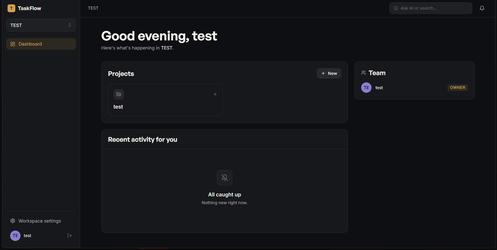 | 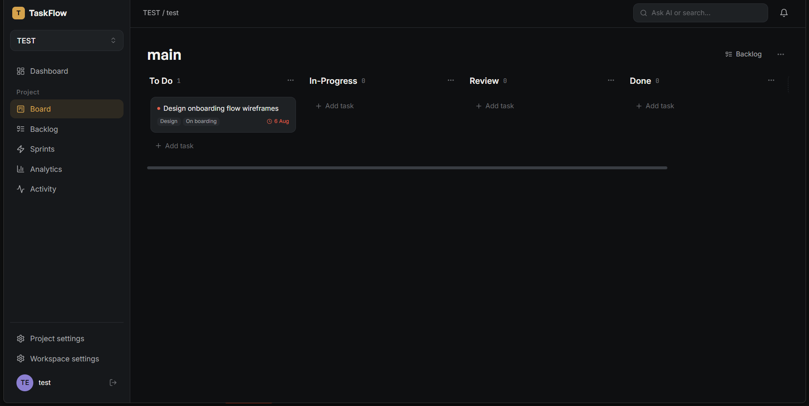 |

| Task Drawer + AI Assist | Sprint Burndown |
|:---:|:---:|
| 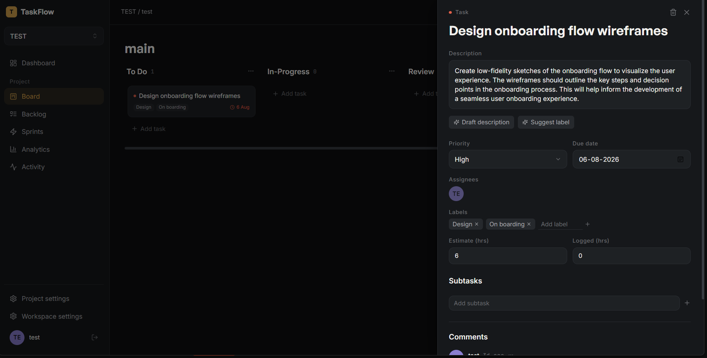 | 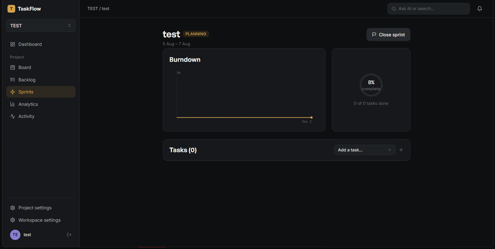 |

| Analytics | Activity |
|:---:|:---:|
| 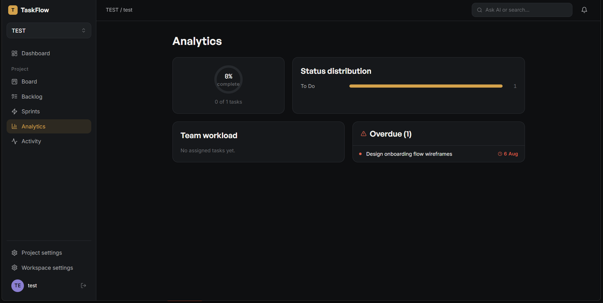 | 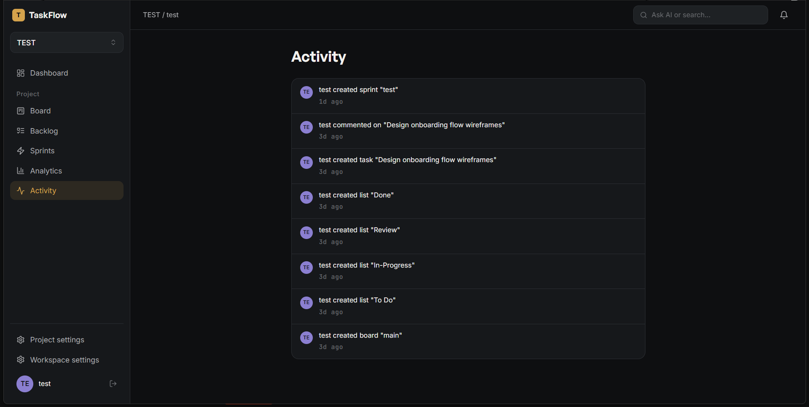 |

</div>

---

## 🎥 Demo

| Resource | Link |
|---|---|
| 🔗 Live Demo | [TaskFlow](https://taskflow-gray-two.vercel.app/) |
| 🏗️ Architecture Diagram | [Jump to section](#-architecture) |

---

## 🛠️ Tech Stack

| Technology | Purpose | Why Chosen |
|---|---|---|
| **React 18 + Vite** | Frontend UI & build tooling | Fast HMR, minimal config, industry-standard component model |
| **Tailwind CSS** | Styling | Utility-first approach lets the entire design-token system live in one config file, not scattered CSS |
| **React Router v6** | Client-side routing | Nested routes map naturally onto the app's nested data model |
| **TanStack React Query** | Server state management | Built-in caching, loading/error states, and optimistic updates with automatic rollback — critical for drag-and-drop |
| **Axios** | HTTP client | Interceptor support for global auth-token attachment and 401 handling |
| **React Hook Form** | Form state & validation | Uncontrolled inputs avoid re-rendering forms on every keystroke |
| **Framer Motion** | Animation | Declarative API integrates cleanly with React; used for drawers, toasts, drag feedback |
| **dnd-kit** | Drag-and-drop | Accessible (keyboard-operable) by default, unlike most drag libraries |
| **Zustand** | One scoped piece of client state | Deliberately minimal — tracks only the actively-dragged task, never duplicates server data |
| **Node.js + Express** | Backend runtime & framework | Mature, minimal-overhead REST API framework |
| **MongoDB + Mongoose** | Database & ODM | Flexible document model fits the nested workspace→project→board→task hierarchy well |
| **JWT + bcrypt** | Authentication | Stateless auth; industry-standard password hashing |
| **node-cron** | Scheduled jobs | In-process scheduling for due-date reminder notifications |
| **Groq API (Llama 3.3 70B)** | AI inference | Fast inference, generous free tier, OpenAI-compatible JSON mode |
| **Render** | Backend hosting | Simple Node deploys with free-tier availability |
| **Vercel** | Frontend hosting | Zero-config Vite/React deploys with instant rollbacks |

---

## 📁 Folder Structure

<details>
<summary><b>Click to expand full folder tree</b></summary>

```
taskflow/
├── backend/
│   ├── server.js
│   ├── package.json
│   └── src/
│       ├── config/
│       │   └── db.js                    # MongoDB connection
│       ├── models/                      # Mongoose schemas
│       │   ├── User.js
│       │   ├── Workspace.js
│       │   ├── Project.js
│       │   ├── Board.js
│       │   ├── List.js
│       │   ├── Task.js
│       │   ├── Comment.js
│       │   ├── Activity.js
│       │   ├── Sprint.js
│       │   └── Notification.js
│       ├── controllers/                 # Business logic
│       ├── middleware/                  # Auth + per-resource access control
│       │   ├── authMiddleware.js
│       │   ├── workspaceMiddleware.js
│       │   ├── projectMiddleware.js
│       │   ├── boardMiddleware.js
│       │   ├── listMiddleware.js
│       │   ├── taskMiddleware.js
│       │   ├── sprintMiddleware.js
│       │   └── commentMiddleware.js
│       ├── routes/                      # Express route definitions
│       ├── utils/
│       │   ├── generateToken.js
│       │   ├── resolveProjectRole.js    # Shared permission-resolution helper
│       │   ├── ordering.js              # Fractional ordering logic
│       │   ├── groqClient.js            # AI provider wrapper
│       │   ├── logActivity.js
│       │   ├── createNotification.js
│       │   └── escapeRegex.js
│       └── jobs/
│           └── reminderJob.js           # node-cron due-date reminders
│
└── frontend/
    ├── vercel.json
    ├── package.json
    └── src/
        ├── main.jsx
        ├── App.jsx
        ├── api/                         # One file per backend resource
        ├── context/                     # AuthContext, ToastContext
        ├── store/
        │   └── boardStore.js            # Zustand — drag UI state only
        ├── routes/
        │   └── ProtectedRoute.jsx
        ├── layouts/                     # Sidebar, Topbar, AppLayout
        ├── pages/                       # Route-level components
        ├── features/                    # Domain-sliced components + hooks
        │   ├── auth/       workspaces/    projects/
        │   ├── boards/      tasks/          comments/
        │   ├── sprints/       analytics/      activity/
        │   ├── notifications/   ai/
        ├── components/ui/               # Reusable primitives
        └── lib/                         # ordering.js, permissions.js, dateUtils.js
```

</details>

---

## 🏗️ Architecture

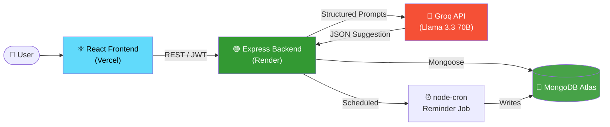

**Layered permission model** — every resource below Workspace resolves access by walking back up through one shared helper:

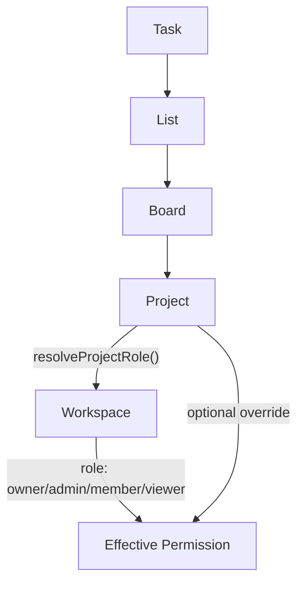

---

## 🔄 Request Flow

Example: dragging a task card to a new list (the app's most state-sensitive interaction).

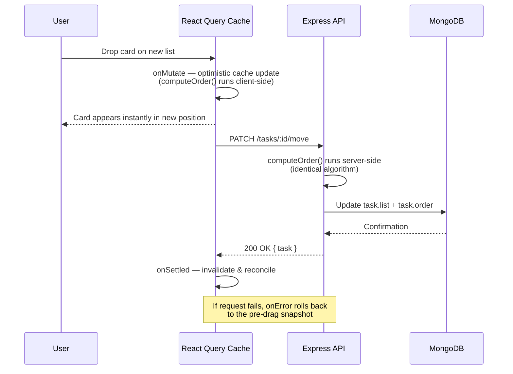

---

## 🗄️ Database Design

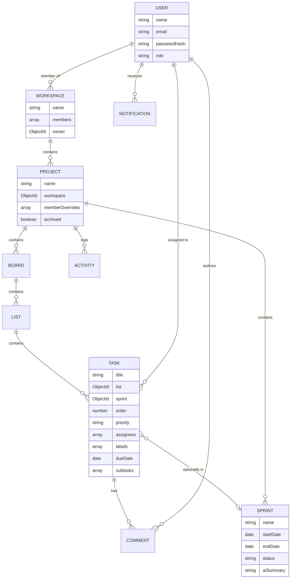

**Key relationship notes:**
- `Workspace.members` and `Project.memberOverrides` are **embedded arrays**, not separate collections — permission checks resolve in a single document fetch.
- `Task.sprint` is a direct reference (not an array on `Sprint`) — this keeps "all tasks in this sprint" a single indexed query rather than an array-membership scan.
- `List.isDoneList` (boolean) — not name-matching — is how analytics/burndown identify "completed" work, so it works regardless of list naming or language.

---

## 📡 API Documentation

<details>
<summary><b>Full endpoint reference (click to expand)</b></summary>

| Resource | Method | Route | Auth Required |
|---|---|---|---|
| Auth | POST | `/api/auth/register` | ❌ |
| Auth | POST | `/api/auth/login` | ❌ |
| Auth | POST | `/api/auth/logout` | ✅ |
| Auth | GET | `/api/auth/me` | ✅ |
| Workspaces | POST / GET | `/api/workspaces` | ✅ |
| Workspaces | GET / PATCH / DELETE | `/api/workspaces/:id` | ✅ (role-gated) |
| Workspaces | POST / PATCH / DELETE | `/api/workspaces/:id/members[/:memberId]` | ✅ Admin+ |
| Projects | POST / GET | `/api/workspaces/:workspaceId/projects` | ✅ |
| Projects | GET / PATCH / DELETE | `/api/projects/:id` | ✅ (role-gated) |
| Projects | POST / DELETE | `/api/projects/:id/overrides[/:memberId]` | ✅ Admin+ |
| Boards | POST / GET | `/api/projects/:projectId/boards` | ✅ |
| Boards | GET / PATCH / DELETE | `/api/boards/:id` | ✅ (role-gated) |
| Lists | POST / GET | `/api/boards/:boardId/lists` | ✅ |
| Lists | PATCH / DELETE | `/api/lists/:id` | ✅ |
| Lists | PATCH | `/api/lists/:id/reorder` | ✅ |
| Tasks | POST / GET | `/api/lists/:listId/tasks` | ✅ |
| Tasks | GET / PATCH / DELETE | `/api/tasks/:id` | ✅ |
| Tasks | PATCH | `/api/tasks/:id/move` | ✅ |
| Tasks | POST / PATCH | `/api/tasks/:id/subtasks[/:subtaskId]` | ✅ |
| Comments | POST / GET | `/api/tasks/:id/comments` | ✅ |
| Comments | PATCH / DELETE | `/api/comments/:id` | ✅ Author/Admin |
| Sprints | POST / GET | `/api/projects/:projectId/sprints` | ✅ |
| Sprints | GET / PATCH / DELETE | `/api/sprints/:id` | ✅ |
| Sprints | POST / DELETE | `/api/sprints/:id/tasks[/:taskId]` | ✅ |
| Sprints | POST | `/api/sprints/:id/close` | ✅ Admin+ |
| Analytics | GET | `/api/projects/:id/analytics/overview` | ✅ |
| Activity | GET | `/api/projects/:id/activity` | ✅ |
| Notifications | GET | `/api/notifications` | ✅ |
| Notifications | PATCH | `/api/notifications/:id/read`, `/read-all` | ✅ |
| AI | POST | `/api/projects/:projectId/ai/draft-task` | ✅ |
| AI | POST | `/api/projects/:projectId/ai/suggest-label` | ✅ |
| AI | POST | `/api/projects/:projectId/ai/search` | ✅ |

</details>

### Representative Examples

<details>
<summary><b>POST /api/auth/register</b></summary>

**Purpose:** Create a new account
**Auth:** None

**Request Body**
```json
{
  "name": "Lakshay Aggarwal",
  "email": "lakshay@example.com",
  "password": "SecurePass123"
}
```

**Response — 201 Created**
```json
{
  "success": true,
  "token": "eyJhbGciOi...",
  "user": {
    "_id": "665f1c...",
    "name": "Lakshay Aggarwal",
    "email": "lakshay@example.com",
    "role": "user"
  }
}
```

**Status Codes:** `201` Created · `400` Missing/invalid fields · `400` Email already in use

</details>

<details>
<summary><b>PATCH /api/tasks/:id/move</b></summary>

**Purpose:** The core drag-and-drop endpoint — moves a task to a (possibly different) list and position in one atomic write
**Auth:** Required, effective role `member+`

**Request Body**
```json
{
  "targetListId": "665f51...",
  "beforeTaskId": null,
  "afterTaskId": "665f60..."
}
```

**Response — 200 OK**
```json
{
  "success": true,
  "task": { "_id": "665f62...", "list": "665f51...", "order": 500 }
}
```

**Status Codes:** `200` OK · `400` Target list not on this board · `403` Insufficient role · `404` Task not found

</details>

<details>
<summary><b>POST /api/projects/:projectId/ai/search</b></summary>

**Purpose:** Natural-language → safe, structured task search
**Auth:** Required, effective role `member+`

**Request Body**
```json
{ "query": "high priority tasks that are overdue" }
```

**Response — 200 OK**
```json
{
  "success": true,
  "interpretedFilters": {
    "priority": "high",
    "isOverdue": true,
    "isDone": null,
    "assigneeNameContains": null,
    "labelContains": null,
    "keywordInTitle": null
  },
  "count": 2,
  "tasks": [ "..." ]
}
```

**Status Codes:** `200` OK · `502` AI provider error · `400` Missing query

</details>

---

## ⚙️ Installation

```bash
# Clone
git clone <your-repo-url>
cd taskflow

# Backend
cd backend
npm install
cp .env.example .env    # fill in values — see Environment Variables
npm run dev              # → http://localhost:5000

# Frontend (new terminal)
cd frontend
npm install
cp .env.example .env
npm run dev              # → http://localhost:5173
```

**Prerequisites:** Node.js 18+, a [MongoDB Atlas](https://www.mongodb.com/atlas) cluster, a free [Groq API key](https://console.groq.com/keys)

---

## 🔑 Environment Variables

**`backend/.env`**

| Variable | Description | Required | Example |
|---|---|---|---|
| `PORT` | Server port | No | `5000` |
| `NODE_ENV` | Environment mode | Yes | `production` |
| `MONGO_URI` | MongoDB connection string | Yes | `mongodb+srv://...` |
| `JWT_SECRET` | Token signing secret | Yes | `openssl rand -base64 32` output |
| `JWT_EXPIRES_IN` | Token lifetime | Yes | `7d` |
| `JWT_COOKIE_EXPIRES_DAYS` | Cookie lifetime (days) | Yes | `7` |
| `CLIENT_URL` | Frontend origin (CORS) | Yes | `https://taskflow.vercel.app` |
| `GROQ_API_KEY` | AI provider key | Yes | From console.groq.com |

**`frontend/.env`**

| Variable | Description | Required | Example |
|---|---|---|---|
| `VITE_API_BASE_URL` | Backend API base URL | Yes | `https://taskflow-api.onrender.com/api` |

---

## 🌐 Deployment

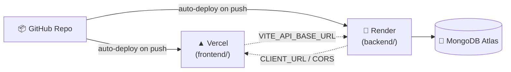

| Layer | Platform | Notes |
|---|---|---|
| Frontend | **Vercel** | Root directory `frontend/`, auto-detects Vite, includes `vercel.json` SPA rewrite so client-side routes don't 404 on refresh |
| Backend | **Render** | Root directory `backend/`, build `npm install`, start `npm start` |
| Database | **MongoDB Atlas** | Free tier, network access `0.0.0.0/0` (required since Render's free-tier IPs aren't static) |

> ⚠️ **Known tradeoff:** Render's free tier spins down after ~15 min of inactivity, meaning the `node-cron` reminder job stops running until the next request wakes the instance. Documented explicitly rather than hidden — a real, explainable constraint of free-tier hosting, not a bug.

Full step-by-step guide (including the cross-origin cookie fix required for split-domain deployment) lives in `DEPLOYMENT.md`.

---

## 🔒 Security

| Measure | Implementation |
|---|---|
| **Authentication** | JWT, issued as both an httpOnly cookie and a Bearer token |
| **Password storage** | bcrypt hashing via a Mongoose `pre('save')` hook — plaintext never persisted or returned in queries (`select: false`) |
| **Cross-origin cookies** | `sameSite: "none"` + `secure: true` in production (frontend/backend on different domains), `"lax"` in local dev |
| **CORS** | Restricted to a single configured `CLIENT_URL`, not wildcard |
| **Environment variables** | All secrets (JWT secret, DB URI, AI key) loaded via `.env`, never committed |
| **Input validation** | Mongoose schema-level validators + `validator.js` for email format |
| **AI query safety** | Natural-language search never lets the model generate or execute a raw database query — it only extracts a constrained set of filter fields, which the backend uses to build the actual Mongo query itself |
| **Regex injection prevention** | User/AI-derived strings used in `$regex` filters are escaped via a dedicated `escapeRegex()` utility before use |
| **Authorization** | Role-based access control resolved through one shared helper (`resolveProjectRole`), reused by every resource — not reimplemented per feature |

> **Not yet implemented:** rate limiting, request throttling, and automated dependency vulnerability scanning are listed under [Future Improvements](#-future-improvements) rather than claimed here.

---

## 🤖 AI Implementation

**Model:** Groq API running Llama 3.3 70B (`llama-3.3-70b-versatile`) — chosen for fast inference and a generous free tier suited to short, structured generations.

**Design principle:** AI is an assistant, never an autonomous writer.

| Feature | Prompt Strategy | Output Handling |
|---|---|---|
| Draft with AI | Title + project context → JSON-mode request for `{ description, acceptanceCriteria }` | Returned to client as a suggestion; only saved if the user clicks "Use this," through the same endpoint a manual edit uses |
| Suggest Label | Title + description → JSON-mode request for `{ label, priority, reasoning }` | Same reviewed-suggestion pattern |
| Smart Search | Natural-language query → JSON-mode request extracting `{ priority, isOverdue, isDone, assigneeNameContains, labelContains, keywordInTitle }` | Backend builds the **actual MongoDB query itself** from these fields — the model never sees or touches the database |
| Sprint Summary | Completed/incomplete task titles + sprint goal → plain-text 3-5 sentence recap | Saved directly to `Sprint.aiSummary` on close, since this is a narrative recap, not an actionable field |

**Error handling:** Every AI call is wrapped so a failure degrades gracefully — closing a sprint still succeeds even if summary generation fails (the field is just left blank), and drafting/suggestion failures surface a toast rather than blocking the task form.

**Provider abstraction:** The backend never calls the Groq SDK directly from controllers — a thin wrapper (`utils/groqClient.js`) exposes exactly two functions (`generateText`, `generateJSON`). This project originally used Google Gemini; switching providers required changing **exactly one file and one import line**, because no controller ever depended on a provider-specific SDK shape.

**Known limitations:** No streaming responses (single request/response per call); no conversation memory (each AI call is stateless and independently prompted); natural-language search quality depends on how the model interprets ambiguous queries — misread filters are surfaced as removable chips so the user can correct them without re-calling the AI.

---

## ⚡ Performance Optimizations

| Optimization | Where | Impact |
|---|---|---|
| **Fractional/gap-based ordering** | Drag-and-drop (lists & tasks) | Reordering is a single-document write, not an O(n) rewrite of every sibling's position |
| **Optimistic UI updates** | React Query `onMutate`/`onError`/`onSettled` | Drag feedback is instant — the UI doesn't wait on a network round-trip |
| **MongoDB aggregation pipelines** | Analytics (`$group`, `$unwind`, `$lookup`) | Status distribution and workload stats computed in the database, not by pulling every task into application memory |
| **Compound indexes** | `List` (board+order), `Task` (list+order, sprint), `Activity` (project+createdAt), `Notification` (user+read+createdAt) | Hot-path queries (board load, notification list) hit indexed fields |
| **Fire-and-forget side effects** | Activity logging, notification creation | Never block the primary request — a logging failure can't fail a task creation |
| **Scoped React Query caching** | Per-resource query keys | A board refetch doesn't invalidate unrelated cached data (sprints, notifications, etc.) |
| **Debounced-by-design AI calls** | Smart Search | Fires only on explicit submit, not per-keystroke — avoids wasted API calls/cost on a real network request |
| **Selective population** | Mongoose `.select()` / `.populate()` scoping | Password hashes and unnecessary fields never leave the database layer |

> Honest note: client-side code-splitting (`React.lazy`) and route-based chunking are **not yet implemented** — the production build currently ships as a single JS bundle (~570KB minified). This is listed under [Future Improvements](#-future-improvements), not claimed as done.

---

## 🧩 Challenges Faced

**1. Permission inheritance across five nested resource types**
A task's permission depends on its list → board → project → workspace chain, optionally overridden at the project level. Rather than reimplementing this per resource, one function (`resolveProjectRole`) became the single source of truth, called by every middleware (board/list/task/sprint/comment) — a correctness bug fixed once is fixed everywhere.

**2. Drag-and-drop that never desyncs client and server**
The frontend mirrors the backend's exact fractional-ordering algorithm (`computeOrder()`) so an optimistic update computes the *same* value the server will compute — meaning a successful drag never visibly "jumps" once the real response arrives. A genuine duplicate-object-key bug was caught during development in the analytics aggregation (`$match` had the key `list` written twice, silently overwriting itself in JS) — worth noting as the kind of subtle bug this architecture makes easier to catch via careful review.

**3. Keeping AI safe without limiting it**
Natural-language search needed to feel powerful without giving a language model write access, or even read-query access, to the database. The solution — constrained field extraction, backend-built queries — closes off prompt injection entirely while still letting users type genuinely natural queries.

**4. Cross-origin auth on a split deployment**
Deploying frontend (Vercel) and backend (Render) on different domains silently breaks `sameSite: "lax"` cookies. Fixed with an environment-aware cookie policy (`"none"` + `secure` in production, `"lax"` locally) — caught and fixed before it became a live-deployment surprise.

**5. Provider-swap-proofing the AI layer**
Built the AI integration behind a two-function interface (`generateText`/`generateJSON`) from day one. When the project later moved from Gemini to Groq, the change touched exactly one new file and one import line — validating that the original abstraction decision was the right one.

---

## 🗺️ Future Improvements

- [ ] Automated test suite (Jest + Supertest for backend, React Testing Library for frontend)
- [ ] CI/CD pipeline (GitHub Actions — lint + test on push)
- [ ] Docker + docker-compose for one-command local setup
- [ ] Real-time sync via WebSockets (currently optimistic request/response + polling)
- [ ] OAuth (Google/GitHub login)
- [ ] File attachments on tasks
- [ ] User avatar upload + editable profile
- [ ] Rate limiting on auth and AI endpoints
- [ ] Frontend code-splitting / route-based lazy loading
- [ ] Multi-language support

---

## 🧪 Testing

The API was built and verified **endpoint-by-endpoint in Postman** during development — every route in the [API Documentation](#-api-documentation) table was manually exercised with real request/response pairs before being considered complete.

**Currently no automated test suite exists** (no Jest/Supertest/RTL tests are checked in) — this is intentionally listed under [Future Improvements](#-future-improvements) rather than glossed over.

To manually verify the backend:
```bash
curl https://<your-backend-url>/api/health
# → {"status":"ok","message":"TaskFlow API is running"}
```

---

## 🤝 Contributing

Contributions are welcome. To propose a change:

```bash
# 1. Fork and clone
git clone https://github.com/LakshayAggarwal12/taskflow.git

# 2. Create a feature branch
git checkout -b feature/your-feature-name

# 3. Commit with a clear message
git commit -m "feat: add X"

# 4. Push and open a Pull Request
git push origin feature/your-feature-name
```

Please open an issue first for significant changes, and keep PRs scoped to one feature or fix at a time.

---

## 🌟 Why This Project Stands Out

- **Full-stack ownership** — every layer, from Mongoose schema design to Framer Motion micro-interactions, was built and reasoned about end-to-end, not scaffolded from a template.
- **Real API design discipline** — nested, permission-aware REST routes (`/workspaces/:id/projects/:id/boards/:id/lists`) that mirror the actual data hierarchy, not a flat CRUD dump.
- **Database design that anticipated its own query patterns** — e.g. `Task.sprint` as a direct reference specifically to keep sprint-membership queries O(1)-indexed rather than array-scanned.
- **Authentication & authorization done properly** — dual cookie/Bearer JWT strategy, environment-aware cross-origin cookie policy, and a single reusable permission-resolution function instead of five copy-pasted role checks.
- **Responsible AI integration** — the natural-language search feature is a legitimate case study in constraining an LLM's blast radius (extract-then-build, never generate-then-execute), which is a genuinely underrated production AI pattern.
- **Production-readiness signals** — real deployment (Render + Vercel), documented known limitations instead of hidden gaps, and a caught-and-fixed cross-origin cookie bug before it shipped.
- **Clean, intentional architecture** — feature-sliced frontend, layered backend middleware, and a state-management strategy that deliberately uses three different tools (Context, React Query, Zustand) for three genuinely different kinds of state, rather than reaching for one tool everywhere.

This project demonstrates the same engineering judgment a production team exercises daily: knowing what to build custom, what to reach for a library for, and what to explicitly leave for later rather than half-build.

---

## 📄 License

Distributed under the **MIT License**. See `LICENSE` for details.

---

## 📬 Contact

**Lakshay Aggarwal**
B.Tech CSE (Data Science) · ABES Engineering College, AKTU

[](https://github.com/LakshayAggarwal12)
[](https://linkedin.com/in/lakshay-aggarwal-dev)
[](mailto:lakshaydev1205@gmail.com)

---

## ⭐ Star History

<a href="https://star-history.com/#LakshayAggarwal12/TaskFlow&Date">
  
</a>

---

## 🙏 Acknowledgements

- [dnd-kit](https://dndkit.com/) — accessible drag-and-drop
- [TanStack Query](https://tanstack.com/query) — server state management
- [Framer Motion](https://www.framer.com/motion/) — animation
- [Groq](https://groq.com/) — AI inference
- Design direction inspired by Linear's typography, Notion's spacing discipline, and Vercel/Raycast's dark-mode restraint

<div align="center">
<sub>Built as a demonstration of full-stack MERN engineering with a scoped, responsibly-designed AI feature layer.</sub>
</div>